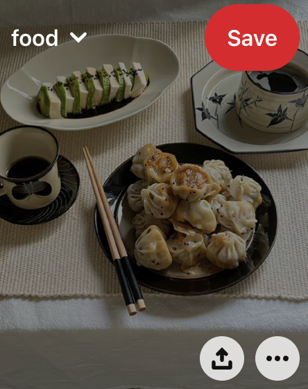

# Description

Implement this design such that:
* There's food on the top left corner of this image.
* There's a button on the top right corner of this image.
* There are two logo buttons on the bottom right corner of this image.
